# 基于SpringBoot的体育馆管理系统

---
### 👉作者QQ ：1556708905 微信：zheng0123Long (支持定制修改、部署调试、定制毕设)

### 👉接网站建设、小程序、H5、APP、各种系统等

---

#### 介绍

随着人们对健康和体育活动的重视不断提高，体育馆作为提供体育服务和活动的重要场所，其管理的高效性和服务的质量变得至关重要。为了满足这一需求，我们开发了这个基于 Spring Boot 的体育馆管理系统，旨在为体育馆的运营提供全面、便捷、智能化的管理解决方案，同时为用户提供优质的服务体验。

#### 技术栈

后端技术栈：Springboot+Mysql+Maven

前端技术栈：Vue+Html+Css+Javascript+ElementUI

开发工具：Idea+Vscode+Navicate

#### 系统功能介绍

（一）管理员角色  
个人中心：管理员可以在个人中心查看和修改自己的个人信息，接收系统通知和重要消息。  
基础数据管理  
场地类型管理：对体育馆内的场地类型进行分类和定义，如篮球场、羽毛球场、游泳池等，并设置相应的参数和规则。  
赛事类型管理：管理不同类型的体育赛事，如篮球比赛、羽毛球比赛、游泳比赛等，包括赛事规则、评分标准等。  
商品类型管理：对体育馆内销售的商品进行分类，如体育用品、饮料、食品等，方便后续的商品管理。  
场地管理  
场地管理：全面管理体育馆内的场地信息，包括场地的位置、面积、设施配备、使用状态等。  
场地预约管理：处理用户的场地预约请求，审核预约信息，安排场地使用时间，确保场地的合理分配和高效利用。  
赛事管理  
赛事管理：组织和安排体育馆内的各类赛事，包括赛事的时间、参赛队伍、裁判安排等。  
赛事评价管理：查看用户对赛事的评价和反馈，了解赛事的优点和不足之处，以便改进和优化后续的赛事组织。  
赛事收藏管理：管理用户对赛事的收藏记录，分析热门赛事和用户关注的焦点，为赛事推广提供依据。  
赛事订单管理：处理赛事相关的订单，如门票销售、参赛报名等，确保赛事的顺利进行和财务流程的清晰。  
商品管理  
商品管理：对体育馆内的商品进行库存管理、价格调整、新品上架等操作。  
商品评价管理：查看用户对商品的评价，了解商品的质量和受欢迎程度，以便优化商品选择和采购策略。  
商品收藏管理：掌握用户对商品的收藏情况，分析热门商品和用户需求趋势。  
商品订单管理：处理商品销售的订单，包括发货、退款、售后等环节，保证商品交易的顺利完成。  
用户管理：对系统注册用户的信息进行管理，包括用户资料审核、权限设置、账户冻结与解冻等操作。  
轮播图信息：设置体育馆的轮播图内容，如最新赛事宣传、优惠活动、场馆介绍等，吸引用户关注。  

（二）用户角色  
场地：查看体育馆内各类场地的详细信息，包括场地介绍、图片展示、使用规则等。  
赛事：了解体育馆举办的赛事安排、赛事详情、参赛要求等信息。  
商品：浏览体育馆内出售的商品，查看商品详情、价格、用户评价等。  
个人中心：修改个人资料，查看自己的预约记录、订单记录、收藏记录等。  
后台管理  
场地管理  
场地管理：查看场地的实时状态，选择合适的场地进行预约。  
场地预约管理：提交场地预约申请，查看预约审核结果，修改或取消已有的预约。  
赛事管理  
赛事管理：关注感兴趣的赛事，查看赛事进展和结果。  
赛事评价管理：对参与过的赛事进行评价和反馈。  
赛事收藏管理：收藏关注的赛事，方便随时查看赛事动态。  
赛事订单管理：购买赛事门票，查看订单状态和交易记录。  
商品管理  
商品管理：挑选需要的商品，加入购物车或直接购买。  
商品评价管理：对购买的商品进行评价和分享使用感受。  
商品收藏管理：收藏心仪的商品，关注商品价格变动和促销活动。  
商品订单管理：查看商品订单的处理进度，申请售后服务。  
轮播图信息：浏览体育馆的轮播图，获取最新的活动和优惠信息。  
购物车：将心仪的商品添加到购物车，统一结算购买。  

#### 系统作用

提升管理效率  
为体育馆管理员提供了一体化的管理工具，实现了对场地、赛事、商品和用户的集中管理，减少了繁琐的人工操作，提高了工作效率。  
优化用户体验  
用户可以方便地查询和预约场地、参与赛事、购买商品，满足了多样化的体育需求，提升了用户对体育馆服务的满意度。  
促进资源合理配置  
通过有效的场地预约管理和赛事安排，充分利用体育馆的资源，避免闲置和浪费。  
增强营销效果  
管理员可以根据用户的收藏、评价和订单数据，进行精准的营销推广，提高赛事和商品的销售额。  
数据统计与决策支持  
系统能够收集和分析大量的运营数据，为体育馆的发展规划和管理决策提供有力的依据。  

#### 系统功能截图

代码结构

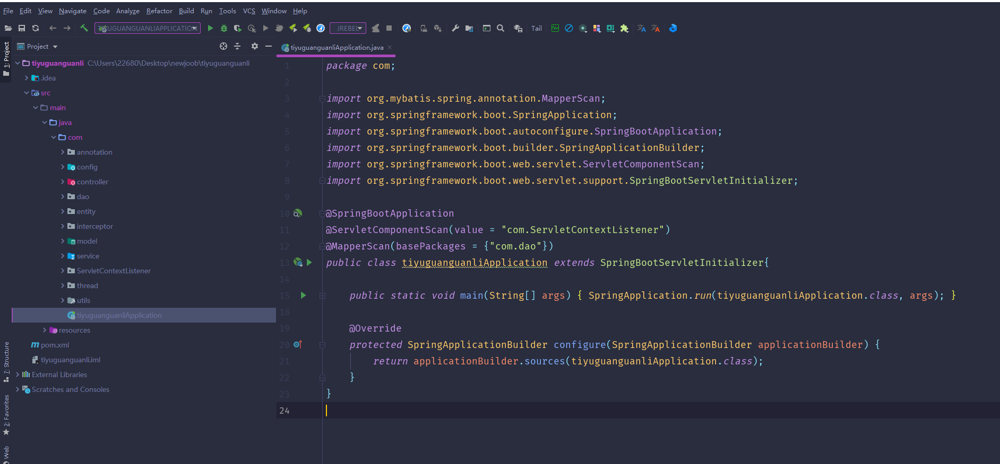

数据库表

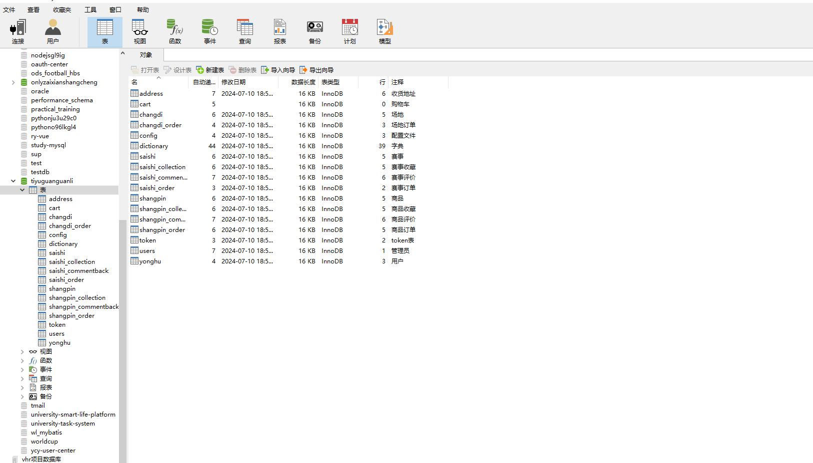

登录

前台页面首页

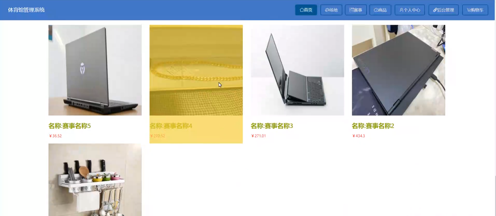

场地

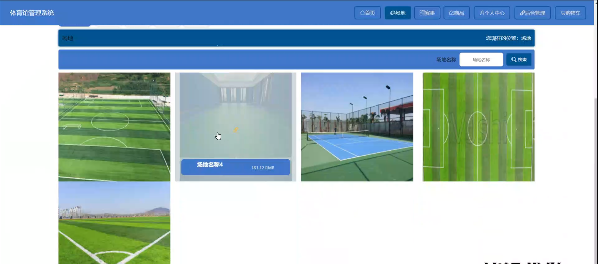

个人中心

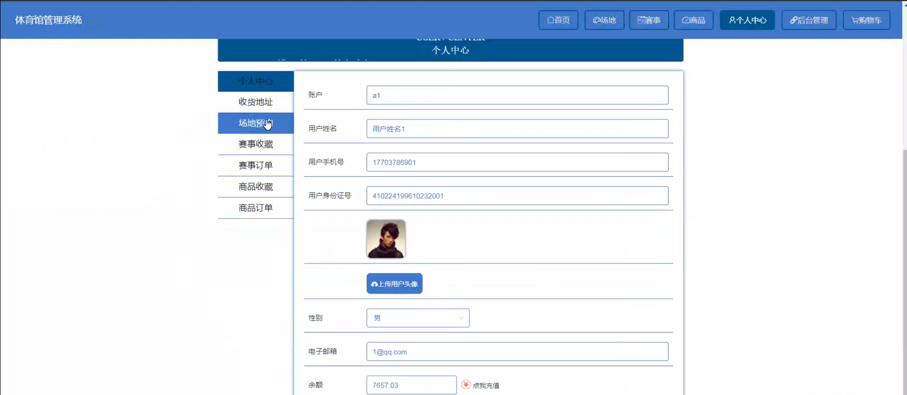

赛事

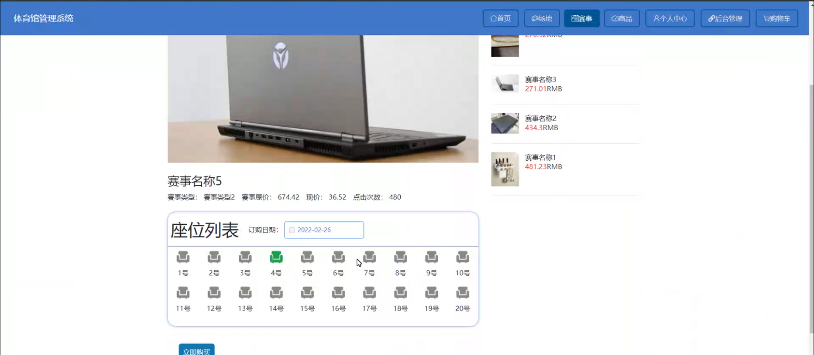

商品

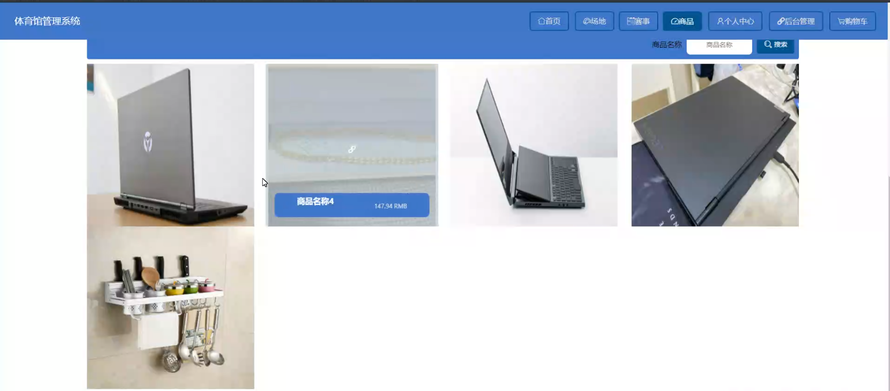

购物车

管理员端后台管理

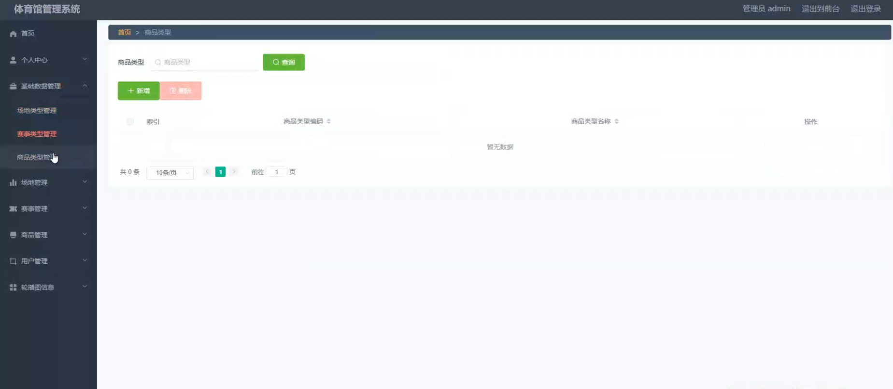

赛事评价管理

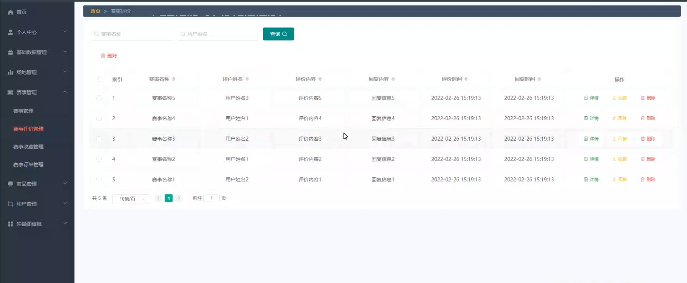

商品订单管理

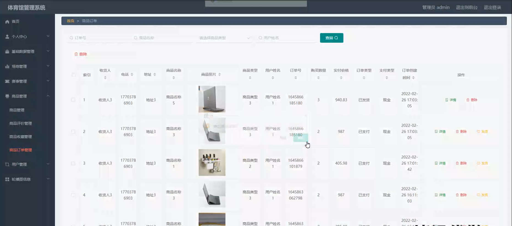

用户端场地管理

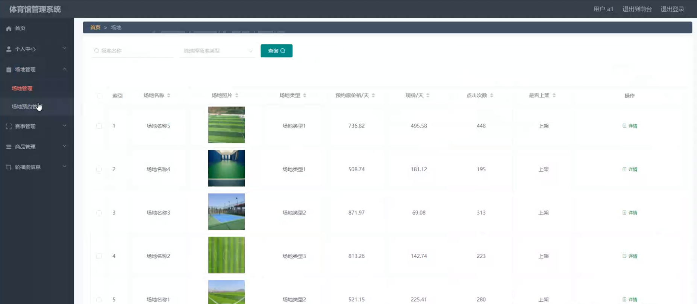

赛事订单管理

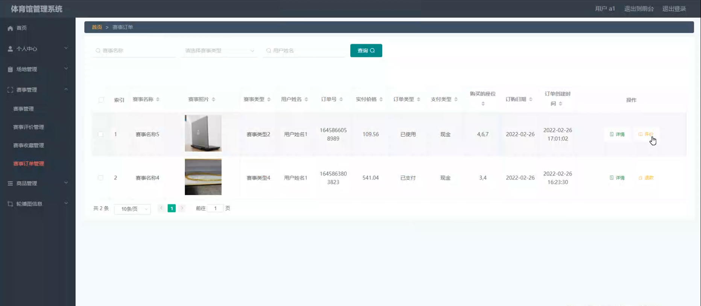

轮播图管理

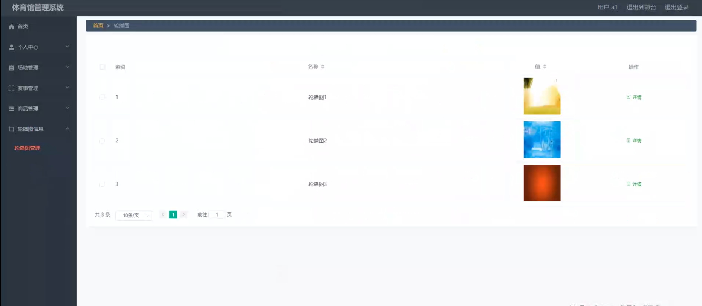

#### 总结

基于 Spring Boot 的体育馆管理系统，通过清晰的角色划分和丰富的功能模块，实现了体育馆运营管理的数字化和智能化。管理员能够高效地管理体育馆的各项事务，用户能够便捷地享受体育馆的服务。该系统有助于提升体育馆的竞争力和服务质量，推动体育事业的发展。

#### 使用说明

创建数据库，执行数据库脚本 修改jdbc数据库连接参数 下载安装maven依赖jar 启动idea中的springboot项目

前台登录页面
http://localhost:8080/tiyuguanguanli/front/index.html

后台登录页面
http://localhost:8080/tiyuguanguanli/admin/dist/index.html

管理员			账户:admin 	密码：admin
用户				账户:a1 		密码：123456